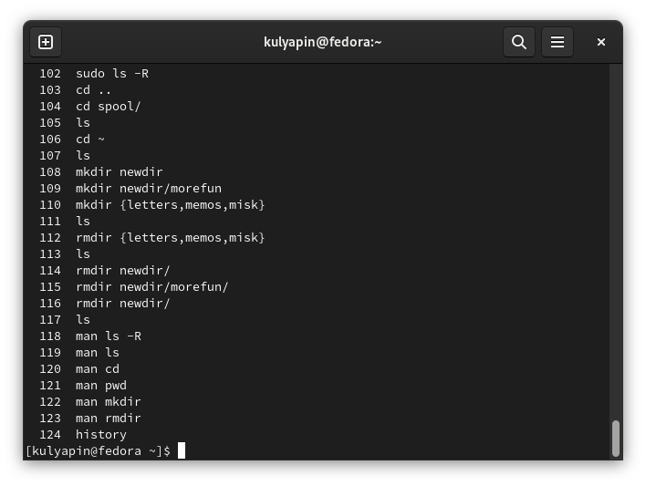

---
## Front matter
lang: ru-RU
title: Лабораторная работа №4
author: |
	Куляпин Т.М, НКАбд-03-22
## Formatting
toc: false
slide_level: 2
theme: metropolis
header-includes: 
 - \metroset{progressbar=frametitle,sectionpage=progressbar,numbering=fraction}
 - '\makeatletter'
 - '\beamer@ignorenonframefalse'
 - '\makeatother'
aspectratio: 43
section-titles: true
---

## Содержание

1. Цель
2. Основные задачи
3. Процесс выполнения
4. Вывод
5. Список литературы

## Цель

Приобретение практических навыков взаимодействия пользователя с системой посредством командной строки.

## Основные задачи

1. Определите полное имя вашего домашнего каталога. Далее относительно этого каталога будут выполняться последующие упражнения.
2. Выполните следующие действия:
2.1. Перейдите в каталог /tmp.
2.2. Выведите на экран содержимое каталога /tmp. Для этого используйте команду ls
с различными опциями. Поясните разницу в выводимой на экран информации.
2.3. Определите, есть ли в каталоге /var/spool подкаталог с именем cron?
2.4. Перейдите в Ваш домашний каталог и выведите на экран его содержимое. Определите, кто является владельцем файлов и подкаталогов?

## Основные задачи

3. Выполните следующие действия:
3.1. В домашнем каталоге создайте новый каталог с именем newdir.
3.2. В каталоге ~/newdir создайте новый каталог с именем morefun.
3.3. В домашнем каталоге создайте одной командой три новых каталога с именами
letters, memos, misk. Затем удалите эти каталоги одной командой.
3.4. Попробуйте удалить ранее созданный каталог ~/newdir командой rm. Проверьте,
был ли каталог удалён.
3.5. Удалите каталог ~/newdir/morefun из домашнего каталога. Проверьте, был ли
каталог удалён.
4. С помощью команды man определите, какую опцию команды ls нужно использовать для просмотра содержимое не только указанного каталога, но и подкаталогов,
входящих в него.

## Основные задачи

5. С помощью команды man определите набор опций команды ls, позволяющий отсортировать по времени последнего изменения выводимый список содержимого каталога
с развёрнутым описанием файлов.
6. Используйте команду man для просмотра описания следующих команд: cd, pwd, mkdir,
rmdir, rm. Поясните основные опции этих команд.
7. Используя информацию, полученную при помощи команды history, выполните модификацию и исполнение нескольких команд из буфера команд.

## Процесс выполнения

1. Определяем полное имя домашнего каталога с помощью команды pwd.(рис. [-@fig:001])

{ #fig:001 width=70% }

## Процесс выполнения

2. Выведем на экран содержимое каталога /tmp с помощью команды ls с различными опциями. (рис. [-@fig:003])

{ #fig:003 width=80% }

Опция -a. (рис. [-@fig:004])

{ #fig:004 width=80% }

## Процесс выполнения

3.  В домашнем каталоге создадим одной командой (mkdir) три новых каталога с именами
letters, memos, misk. Затем удалим эти каталоги одной командой (rmdir). (рис. [-@fig:011])

{ #fig:011 width=80% }

## Процесс выполнения

4. С помощью команды man определим, какую опцию команды ls нужно использовать для просмотра содержимое не только указанного каталога, но и подкаталогов, входящих в него. Узнаем, что это можно сделать с помощью опции -R. (рис. [-@fig:014])

{ #fig:014 width=80% }

## Процесс выполнения

7. Используя информацию, полученную при помощи команды history, выполним модификацию и исполнение нескольких команд из буфера команд. (рис. [-@fig:021])

{ #fig:021 width=80% }

## Вывод

Научилась работать с командной строкой. Изучила различные команды и научилась их применять.

## Список литературы

1. Командная строка Windows [Электронный ресурс]. URL:
https://foxford.ru/wiki/informatika/komandnaya-stroka-windows.

## {.standout}

Спасибо за внимание
