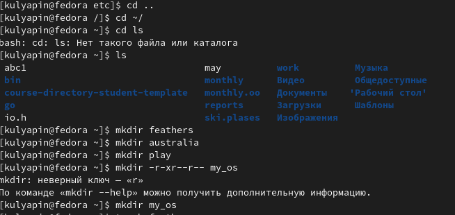
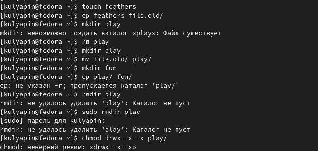
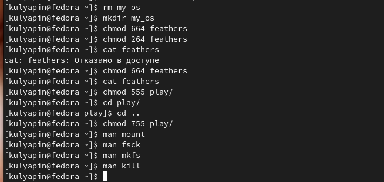
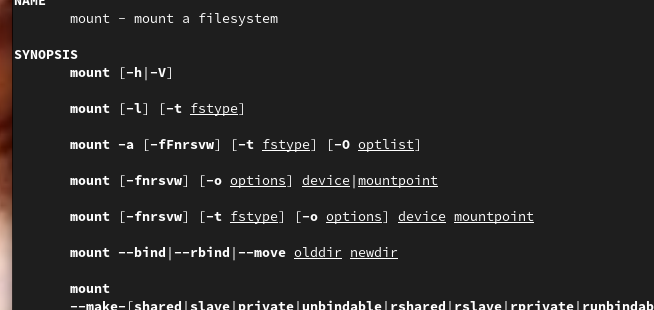

---
## Front matter
lang: ru-RU
title: "Лабораторная работа №5. Анализ файловой системы Linux. Команды для работы с файлами и каталогами"
author: |
	Куляпин Тимофей.; НКАбд-03-22
	
## Formatting
toc: false
slide_level: 2
theme: metropolis
header-includes: 
 - \metroset{progressbar=frametitle,sectionpage=progressbar,numbering=fraction}
 - '\makeatletter'
 - '\beamer@ignorenonframefalse'
 - '\makeatother'
aspectratio: 43
section-titles: true
---

## Цель работы

Ознакомление с файловой системой Linux, её структурой, именами и содержанием каталогов. Приобретение практических навыков по применению команд для работы с файлами и каталогами, по управлению процессами (и работами), по проверке использования диска и обслуживанию файловой системы.

## Задание

1. Выполните все примеры, приведённые в первой части описания лабораторной работы.
2. Выполните следующие действия:
2.1. Скопируйте файл /usr/include/sys/io.h в домашний каталог и назовите его
equipment. Если файла io.h нет, то используйте любой другой файл в каталоге
/usr/include/sys/ вместо него.
2.2. В домашнем каталоге создайте директорию ~/ski.plases.
2.3. Переместите файл equipment в каталог ~/ski.plases.
2.4. Переименуйте файл ~/ski.plases/equipment в ~/ski.plases/equiplist.
2.5. Создайте в домашнем каталоге файл abc1 и скопируйте его в каталог
~/ski.plases, назовите его equiplist2.
2.6. Создайте каталог с именем equipment в каталоге ~/ski.plases.
2.7. Переместите файлы ~/ski.plases/equiplist и equiplist2 в каталог
~/ski.plases/equipment.
2.8. Создайте и переместите каталог ~/newdir в каталог ~/ski.plases и назовите
его plans.

## Задание

3. Определите опции команды chmod, необходимые для того, чтобы присвоить перечисленным ниже файлам выделенные права доступа, считая, что в начале таких прав
нет:
3.1. drwxr--r-- ... australia
3.2. drwx--x--x ... play
3.3. -r-xr--r-- ... my_os
3.4. -rw-rw-r-- ... feathers
При необходимости создайте нужные файлы.

## Задание

4. Проделайте приведённые ниже упражнения:
4.1. Просмотрите содержимое файла /etc/password.
4.2. Скопируйте файл ~/feathers в файл ~/file.old.
4.3. Переместите файл ~/file.old в каталог ~/play.
4.4. Скопируйте каталог ~/play в каталог ~/fun.
4.5. Переместите каталог ~/fun в каталог ~/play и назовите его games.
4.6. Лишите владельца файла ~/feathers права на чтение.
4.7. Что произойдёт, если вы попытаетесь просмотреть файл ~/feathers командой
cat?
4.8. Что произойдёт, если вы попытаетесь скопировать файл ~/feathers?
4.9. Дайте владельцу файла ~/feathers право на чтение.
4.10. Лишите владельца каталога ~/play права на выполнение.
4.11. Перейдите в каталог ~/play. Что произошло?
4.12. Дайте владельцу каталога ~/play право на выполнение.
5. Прочитайте man по командам mount, fsck, mkfs, kill и кратко их охарактеризуйте,
приведя примеры.

## Теоретическое введение

Файловая система (ФС) — архитектура хранения данных, которые могут находиться в разделах жесткого диска и ОП. Выдает пользователю доступ к конфигурации ядра. Определяет, какую структуру принимают файлы в каждом из разделов, создает правила для их генерации, а также управляет файлами в соответствии с особенностями каждой конкретной ФС.
Основные файловые системы, используемые в дистрибутивах Linux: Ext2; Ext3; Ext4; JFS; ReiserFS; XFS; Btrfs; ZFS. Ext2, Ext3, Ext4 или Extended Filesystem – стандартная файловая система, первоначально разработанная еще для Minix.

## Выполнение лабораторной работы

1. Выполните все примеры, приведённые в первой части описания лабораторной работы. (рис. [-@fig:001])

{ #fig:001 width=70% }

## Выполнение лабораторной работы

2. Скопируйте файл /usr/include/sys/io.h в домашний каталог и назовите его
equipment. Если файла io.h нет, то используйте любой другой файл в каталоге
/usr/include/sys/ вместо него. (рис. [-@fig:007])

{ #fig:007 width=70% }

## Выполнение лабораторной работы

В домашнем каталоге создайте директорию ~/ski.plases.
Переместите файл equipment в каталог ~/ski.plases.
Переименуйте файл ~/ski.plases/equipment в ~/ski.plases/equiplist. (рис. [-@fig:008])

{ #fig:008 width=70% }

## Выполнение лабораторной работы

Создайте в домашнем каталоге файл abc1 и скопируйте его в каталог
~/ski.plases, назовите его equiplist2.
Создайте каталог с именем equipment в каталоге ~/ski.plases.
Переместите файлы ~/ski.plases/equiplist и equiplist2 в каталог
~/ski.plases/equipment. (рис. [-@fig:009])

{ #fig:009 width=70% }

## Выполнение лабораторной работы

3. Определите опции команды chmod, необходимые для того, чтобы присвоить перечисленным ниже файлам выделенные права доступа, считая, что в начале таких прав
нет:
drwxr--r-- ... australia;
drwx--x--x ... play;
-r-xr--r-- ... my_os;
-rw-rw-r-- ... feathers.
При необходимости создайте нужные файлы. (рис. [-@fig:012])

{ #fig:012 width=60% }

## Выполнение лабораторной работы

4. Проделайте приведённые ниже упражнения, записывая в отчёт по лабораторной
работе используемые при этом команды:
Просмотрите содержимое файла /etc/password. (рис. [-@fig:014])

{ #fig:014 width=70% }

## Выполнение лабораторной работы

Скопируйте файл ~/feathers в файл ~/file.old.
Переместите файл ~/file.old в каталог ~/play.
Скопируйте каталог ~/play в каталог ~/fun.  (рис. [-@fig:015])

{ #fig:015 width=70% }

## Выполнение лабораторной работы

Переместите каталог ~/fun в каталог ~/play и назовите его games. (рис. [-@fig:016])

{ #fig:016 width=70% }

## Выполнение лабораторной работы

Лишите владельца файла ~/feathers права на чтение.
Что произойдёт, если вы попытаетесь просмотреть файл ~/feathers командой
cat?
Что произойдёт, если вы попытаетесь скопировать файл ~/feathers?
Дайте владельцу файла ~/feathers право на чтение.
Лишите владельца каталога ~/play права на выполнение. (рис. [-@fig:017])

{ #fig:017 width=70% } 

## Выполнение лабораторной работы

Перейдите в каталог ~/play. Что произошло?
Дайте владельцу каталога ~/play право на выполнение.  (рис. [-@fig:018])

{ #fig:018 width=70% } 

## Выполнение лабораторной работы

5. Прочитайте man по командам mount, fsck, mkfs, kill и кратко их охарактеризуйте,
приведя примеры.  (рис. [-@fig:023])

{ #fig:023 width=70% }

## Выводы

Ознакомилась с файловой системой Linux и с ее структурой. Научилась использовать различные команды в терминале для работы с файлами и каталогами.

## Список литературы

1. Структура и типы файловых систем в Linux [Электронный ресурс]. URL:
https://selectel.ru/blog/directory-structure-linux/.
2. Типы файловых систем, их предназначение и отличия [Электронный ре-
сурс]. URL: https://timeweb.com/ru/community/articles/tipy-faylovyh-
sistem-ih-prednaznachenie-i-otlichiya#:~:text=Основные%20файловые%20
системы%2C%20используемые%20в,с%20редкими%20изменениями%20
кодовой%20базы.

## {.standout}

Спасибо за внимание
