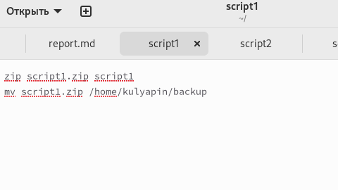
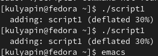
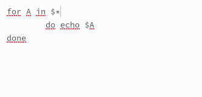
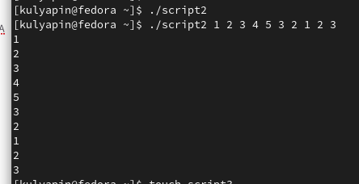
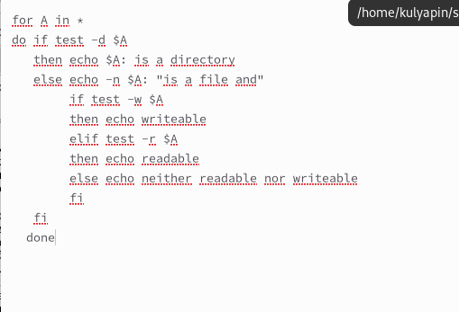
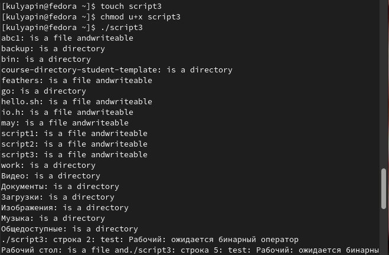
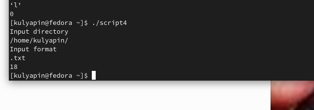

---
## Front matter
lang: ru-RU
title: Лабораторная работа 10
subtitle: Программирование в командном процессоре юникс
author:
  - Куляпин Т. М.
institute:
  - Российский университет дружбы народов, Москва, Россия
  - Объединённый институт ядерных исследований, Дубна, Россия
date: 15 апреля 2023

## i18n babel
babel-lang: russian
babel-otherlangs: english

## Formatting pdf
toc: false
toc-title: Содержание
slide_level: 2
aspectratio: 169
section-titles: true
theme: metropolis
header-includes:
 - \metroset{progressbar=frametitle,sectionpage=progressbar,numbering=fraction}
 - '\makeatletter'
 - '\beamer@ignorenonframefalse'
 - '\makeatother'
---

## Цели и задачи

Изучить основы программирования в оболочке ОС юникс. Научиться писать небольшие командные файлы.
## Zadachi
1. Написать скрипт, который при запуске будет делать резервную копию самого себя (то
есть файла, в котором содержится его исходный код) в другую директорию backup
в вашем домашнем каталоге. При этом файл должен архивироваться одним из ар-
хиваторов на выбор zip, bzip2 или tar. Способ использования команд архивации
необходимо узнать, изучив справку.
---
##Zadachi
2. Написать пример командного файла, обрабатывающего любое произвольное число
аргументов командной строки, в том числе превышающее десять. Например, скрипт
может последовательно распечатывать значения всех переданных аргументов.
---
##Zadachi
3. Написать командный файл — аналог команды ls (без использования самой этой ко-
манды и команды dir). Требуется, чтобы он выдавал информацию о нужном каталоге
и выводил информацию о возможностях доступа к файлам этого каталога.
---
##Zadachi
4. Написать командный файл, который получает в качестве аргумента командной строки
формат файла (.txt, .doc, .jpg, .pdf и т.д.) и вычисляет количество таких файлов
в указанной директории. Путь к директории также передаётся в виде аргумента ко-
мандной строки.
---
**1.** Открыл файл script1 и написал код, который создаёт архив, содержащий сам файл, и перемещает его в папку *backup*.(рис.[-@fig:001])

{#fig:001 width=70%}

Запустил скрипт(рис.[-@fig:002])
{#fig:002 width=70%}
Проверка.(рис. [-fig:003])
{#fig:003 width=70%}
**2.** Открыл файл *script2* написал цикл *for*, который последовательно выводит значения всех переданных аргументов(рис.[-fig:004])
{ #fig:005 width=70%}
Запустил скрипт(рис.[-@fig:005])
{#fig:005 width=70%}
**3.** Открыл файл *script3* и скопировал программу из теории к лабораторной работы.(рис.[-@fig:006])
{#fig:006 width=70%}
Проверка.(рис. [-fig:003])
{#fig:007 width=70%}
**4.** Открыл файл *script4*. Написал программу, которая попросит ввести путь к директории и формат файла, а затем выводит кол-во файлов с данным форматом в данной директории.(рис.[-@fig:008])
[Код 4 скрипта](image/8.png){#fig:008 width=70%}

Проверил работу скрипта(рис.[-@fig:009])
{#fig:002 width=70%}
# Выводы

Мы научились писать небольшие программы.

